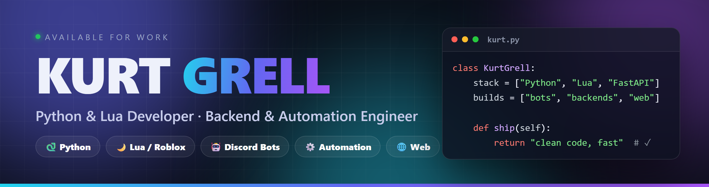

<!-- ═══════════════════════════════════════════════════════════════════════ -->
<!--                              HERO BANNER                                -->
<!-- ═══════════════════════════════════════════════════════════════════════ -->

<div align="center">



<!-- ═══════════════════════════════════════════════════════════════════════ -->
<!--                            TYPING ANIMATION                             -->
<!-- ═══════════════════════════════════════════════════════════════════════ -->

<a href="https://github.com/KurtGrell-cyber">
  
</a>

<!-- ═══════════════════════════════════════════════════════════════════════ -->
<!--                            PROFILE BADGES                               -->
<!-- ═══════════════════════════════════════════════════════════════════════ -->

<p>
  
  <a href="https://github.com/KurtGrell-cyber?tab=followers">
    
  </a>
  <a href="mailto:kurtegrell@gmail.com">
    
  </a>
</p>

</div>

<!-- ═══════════════════════════════════════════════════════════════════════ -->
<!--                              ABOUT ME                                   -->
<!-- ═══════════════════════════════════════════════════════════════════════ -->

## 🚀 About Me

```python
class KurtGrell:
    def __init__(self):
        self.name = "Kurt Grell"
        self.role = ["Python Developer", "Lua Developer", "Automation Engineer"]
        self.focus = ["Backend Systems", "Discord Bots", "AI Tooling"]
        self.stack = ["Python", "Lua", "FastAPI", "PostgreSQL", "Docker", "Linux"]
        self.mindset = "Clean code · Automation · Open Source"

    def current_goal(self):
        return "Building reliable backends and bots that just work."
```

- 🐍 **Python & Lua developer** focused on clean, maintainable backends.
- ⚙️ I build **automation tools, Discord bots, and AI-powered utilities**.
- 🧠 Big on **APIs, databases, and infrastructure** — FastAPI, PostgreSQL, Docker, Linux.
- 🤖 Exploring **AI integrations** with the OpenAI & Claude APIs.
- 🌱 Currently leveling up my open-source presence — **this profile is just getting started**.
- 💬 Open to **collaboration, freelance work, and interesting backend problems**.

<br/>

<!-- ═══════════════════════════════════════════════════════════════════════ -->
<!--                              TECH STACK                                 -->
<!-- ═══════════════════════════════════════════════════════════════════════ -->

## 🛠️ Tech Stack

<div align="center">

#### 💻 Languages


#### ⚙️ Backend & Frameworks


#### 🗄️ Databases


#### 🧰 Tools & Platforms


#### 🤖 AI & Automation


</div>

<br/>

<!-- ═══════════════════════════════════════════════════════════════════════ -->
<!--                            GITHUB STATS                                 -->
<!-- ═══════════════════════════════════════════════════════════════════════ -->

## 📊 GitHub Stats

<div align="center">


<br/><br/>


</div>

<br/>

<!-- ═══════════════════════════════════════════════════════════════════════ -->
<!--                          ACTIVITY GRAPH                                 -->
<!-- ═══════════════════════════════════════════════════════════════════════ -->

## 📈 Contribution Activity

<div align="center">


</div>

<br/>

<!-- ═══════════════════════════════════════════════════════════════════════ -->
<!--                              TROPHIES                                   -->
<!-- ═══════════════════════════════════════════════════════════════════════ -->

## 🏆 GitHub Trophies

<div align="center">


</div>

<br/>

## 🚀 Projects

<div align="center">
<i>Sorted by category — Discord bots, websites, web apps, Roblox & tools. Most have a live demo you can open in one click.</i>
</div>

### ✨ Featured

<table>
<tr>
<td width="33%" valign="top" align="center">
<a href="https://kurtgrell-cyber.github.io/nebula/"></a>
<b>Nebula</b> · SaaS theme<br/><sub><a href="https://github.com/KurtGrell-cyber/nebula">code</a> · <a href="https://kurtgrell-cyber.github.io/nebula/">🔗 live</a></sub>
</td>
<td width="33%" valign="top" align="center">
<a href="https://kurtgrell-cyber.github.io/cryptopulse/"></a>
<b>CryptoPulse</b> · live crypto<br/><sub><a href="https://github.com/KurtGrell-cyber/cryptopulse">code</a> · <a href="https://kurtgrell-cyber.github.io/cryptopulse/">🔗 live</a></sub>
</td>
<td width="33%" valign="top" align="center">
<a href="https://github.com/KurtGrell-cyber/coinflow"></a>
<b>CoinFlow</b> · economy bot<br/><sub><a href="https://github.com/KurtGrell-cyber/coinflow">code</a></sub>
</td>
</tr>
<tr>
<td width="33%" valign="top" align="center">
<a href="https://github.com/KurtGrell-cyber/rankup"></a>
<b>RankUp</b> · leveling bot<br/><sub><a href="https://github.com/KurtGrell-cyber/rankup">code</a></sub>
</td>
<td width="33%" valign="top" align="center">
<a href="https://github.com/KurtGrell-cyber/roblox-kit"></a>
<b>roblox-kit</b> · Luau systems<br/><sub><a href="https://github.com/KurtGrell-cyber/roblox-kit">code</a></sub>
</td>
<td width="33%" valign="top" align="center">
<a href="https://kurtgrell-cyber.github.io/taskflow/"></a>
<b>TaskFlow</b> · Kanban<br/><sub><a href="https://github.com/KurtGrell-cyber/taskflow">code</a> · <a href="https://kurtgrell-cyber.github.io/taskflow/">🔗 live</a></sub>
</td>
</tr>
</table>

### 🤖 Discord Bots

| Bot | What it does |
|:----|:-------------|
| 🧩 [**ForgeBot**](https://github.com/KurtGrell-cyber/forgebot) | Modular bot **framework** — moderation, tickets, economy, giveaways & AI chat |
| 🎫 [**HelpDesk**](https://github.com/KurtGrell-cyber/helpdesk) | Support **ticket** system — panels, private channels, claiming & transcripts |
| 🪙 [**CoinFlow**](https://github.com/KurtGrell-cyber/coinflow) | **Economy** — daily / work / gamble / pay, shop, inventory & leaderboard |
| 📈 [**RankUp**](https://github.com/KurtGrell-cyber/rankup) | **Leveling** with Pillow-generated rank cards & XP leaderboard |
| 🛡️ [**Sentinel**](https://github.com/KurtGrell-cyber/sentinel) | **Moderation & anti-raid** — AutoMod, infractions, raid detection |
| 🎵 [**Cadence**](https://github.com/KurtGrell-cyber/cadence) | **Music** (wavelink / Lavalink) — queue, loop, volume, now-playing |

### 🌐 Websites & Landing Pages

| Site | Description | |
|:-----|:------------|:--|
| ✦ [**Nebula**](https://github.com/KurtGrell-cyber/nebula) | Premium SaaS theme with full animations & transitions | [🔗 Live](https://kurtgrell-cyber.github.io/nebula/) |
| ◆ [**Nexoria**](https://github.com/KurtGrell-cyber/nexoria) | Hosting landing — pricing, live status, testimonials | [🔗 Live](https://kurtgrell-cyber.github.io/nexoria/) |
| ✦ [**Synthia**](https://github.com/KurtGrell-cyber/synthia) | AI product SaaS landing with animated chat mockup | [🔗 Live](https://kurtgrell-cyber.github.io/synthia/) |
| 🧊 [**KG.dev**](https://github.com/KurtGrell-cyber/kg-portfolio) | Developer portfolio — Three.js 3D background | [🔗 Live](https://kurtgrell-cyber.github.io/kg-portfolio/) |

### ⚡ Web Apps & Games

| App | Description | |
|:----|:------------|:--|
| ◈ [**Metrica**](https://github.com/KurtGrell-cyber/metrica) | Analytics dashboard — hand-drawn Canvas charts, dark/light | [🔗 Live](https://kurtgrell-cyber.github.io/metrica/) |
| 📈 [**CryptoPulse**](https://github.com/KurtGrell-cyber/cryptopulse) | Real-time crypto dashboard (live CoinGecko API) | [🔗 Live](https://kurtgrell-cyber.github.io/cryptopulse/) |
| 🗂️ [**TaskFlow**](https://github.com/KurtGrell-cyber/taskflow) | Kanban board with native drag & drop | [🔗 Live](https://kurtgrell-cyber.github.io/taskflow/) |
| 💰 [**Ledgerly**](https://github.com/KurtGrell-cyber/ledgerly) | Finance tracker with a Canvas donut chart | [🔗 Live](https://kurtgrell-cyber.github.io/ledgerly/) |
| 🌤️ [**Skyline**](https://github.com/KurtGrell-cyber/skyline) | Weather dashboard (live Open-Meteo API) | [🔗 Live](https://kurtgrell-cyber.github.io/skyline/) |
| 🎮 [**Neon 2048**](https://github.com/KurtGrell-cyber/neon-2048) | Polished 2048 game with a hand-written engine | [🔗 Play](https://kurtgrell-cyber.github.io/neon-2048/) |

### 🎮 Roblox / Lua

| Project | Description |
|:--------|:------------|
| 🌙 [**roblox-kit**](https://github.com/KurtGrell-cyber/roblox-kit) | Exploit-safe **Luau** game systems — DataStore save layer, currency, server-validated shop & inventory (Rojo-ready) |

### 🛠️ Tools & CLI

| Tool | Description |
|:-----|:------------|
| 🧠 [**codesage**](https://github.com/KurtGrell-cyber/codesage) | AI code assistant for the terminal — explain, fix, review, generate (Claude) |
| 🔐 [**lockbox**](https://github.com/KurtGrell-cyber/lockbox) | AES-256-GCM file encryption CLI with scrypt KDF (tested) |
| 📊 [**serverpulse**](https://github.com/KurtGrell-cyber/serverpulse) | Real-time VPS monitoring dashboard (FastAPI + WebSocket) |
| ⛏️ [**craftpanel**](https://github.com/KurtGrell-cyber/craftpanel) | Zero-dependency Minecraft server manager CLI |

<br/>

<!-- ═══════════════════════════════════════════════════════════════════════ -->
<!--                              CONNECT                                    -->
<!-- ═══════════════════════════════════════════════════════════════════════ -->

## 🤝 Let's Connect

<div align="center">

<a href="mailto:kurtegrell@gmail.com">
  
</a>
<a href="https://github.com/KurtGrell-cyber">
  
</a>

<br/><br/>

<i>💬 Open to freelance projects, collaboration, and backend / automation work.</i>


</div>
